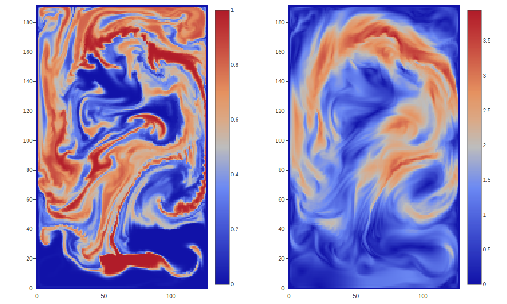

# Φ-*Flow*



Φ-*Flow* is an open-source fluid simulation toolkit.
It is written entirely in Python and targets TensorFlow and NumPy for execution.

Having all functionality of a fluid simulation running in TensorFlow opens up the possibility of back-propagating gradients through the simulation as well as running the simulation on GPUs.


## Features
- Tight integration with [TensorFlow](https://www.tensorflow.org/) making network training easy
- All simulation steps are differentiable
- Fluid simulations can be run completely on the GPU
- Easy visualization of live data in the browser with a powerful interactive GUI
- Tweaking of network hyperparameters during training through the GUI
- Native support for n-dimensional fluid simulations
- Weak dependency on TensorFlow, allowing for execution of simulations with NumPy and SciPy
- Option of application deployment as Flask web-service


## Installation

See the [detailed installation instructions](documentation/install.md) on how to install Φ-*Flow*.
Here is the short version:
```
$ pip install tensorflow
$ git clone https://gitlab.lrz.de/ga67fet/phiflow.git
$ cd mantaflowgit
$ git checkout phiflow/master
$ python setup.py cuda
$ pip install .[gui]
```

## Documentation and Guides

If you would like to get right into it and have a look at some example code, check out the following files in the `apps` directory:

- [simulation101.py](apps/simulation101.py): Runs a state simulation and displays it in the browser
- [optimize_pressure.py](apps/optimize_pressure.py): Uses TensorFlow to optimize a velocity channel. TensorBoard can be started from the GUI and displays the loss.


The [simulation documentation](documentation/sim.md) explains the core simulation classes and gives code examples of how to use them.

[Writing a Φ-*Flow* Application](documentation/gui.md) introduces the high-level classes and expalins how to use the Φ-*Flow* GUI.

For I/O and data management, see the [data documentation](documentation/data.md).

(If the links are not working, go into the documentation folder and open the Markdown files manually)


## Directory structure

The directory structure is as follows:

- [apps](apps) contains python executables that use Φ-*Flow* and display the simulation using the GUI.
- [documentation](documentation) further information and guides.
- [phi](phi) and subpackages contain the core Φ-*Flow* library.
- [tests](tests) contains tests of Φ-*Flow* that mostly run without Gui.


## Known Issues

GUI: Update problem with some Chrome installations on Windows.

TensorBoard: Live supervision does not work when running a local app that writes to a remote directory.