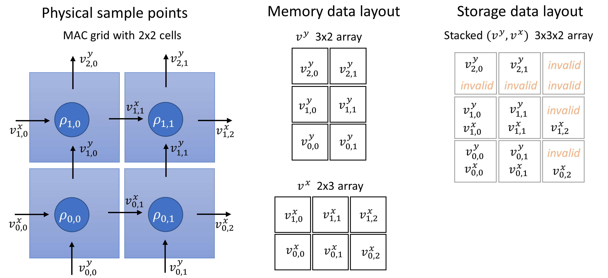

# Staggered grids

Staggered grids are a key component of the marker-and-cell (MAC) method. They sample the velocity components at the centers of the corresponding lower faces of grid cells. This makes them fundamentally different from regular arrays or tensors which are sampled at the cell centers.
A central advantage of Staggered grids is that it makes operations such as computing the divergence of a flow field straightforward and exact.



In Φ<sub>*Flow*</sub>, staggered grids are represented as instances of [StaggeredGrid](../phi/physics/field/staggered_grid.py) and implement the [Field API](Fields.md). They have one more entry in every spatial dimension than corresponding centered fields since the upper face of the upper most cell needs to be included as well.

Staggered grids can either be created directly from an array or tensor holding the staggered values or
using an initializer,

```python
from phi.tf.flow import *

grid = Grid([64, 64])
staggered_zeros = zeros(grid.staggered_shape())
staggered_placeholder = placeholder(grid.staggered_shape(batch_size=16))
```

States such as [Smoke](../phi/physics/smoke.py) ([documentation](Smoke_Simulation.md)) that use staggered grids will automatically create one if not provided.

```python
from phi.tf.flow import *

smoke = Smoke(Domain([64, 64]), velocity=placeholder)
```

Staggered grids can also be created from centered fields. The first example below stores the spatial
derivatives for each axis in the staggered grid, while the second call initializes a staggered grid with
the size of the centered one, and multiples it with (2,1) for x and y components, respectively, to obtain
a 2D vector quantity. Note that because the centered grid is interpolated at the faces of the staggered one,
by default the values at the boundary will drop off:

```python
from phi.flow import *

centered_field = CenteredGrid("cent" , AABox([0,0],[1,1]), np.ones([1, 64, 64, 1]) )

staggered_gradient = StaggeredGrid.gradient(centered_field)
staggered_field_x = StaggeredGrid.from_scalar(centered_field, [1, 2])
```

`StaggeredGrid`s can hold both TensorFlow `Tensor`'s and NumPy `ndarray`s.
They support basic backend operations and can be passed to `phi.tf.session.Session.run()` like TensorFlow tensors.

Some useful operations include:

```python
from phi.physics.flow import *

smoke = Smoke([64, 64])
velocity = smoke.velocity

# Advect a centered field
advected_density = velocity.advect(smoke.density)
# Advect a staggered field
advected_velocity = velocity.advect(smoke.velocity)
# Compute the curl of a vector potential
curl = velocity.curl()
# Compute the centered divergence field
divergence = velocity.divergence()
```

To get a `Tensor` or `ndarray` object from a staggered grid, one of the following sampling methods can be used.

```python
from phi.physics.flow import *

smoke = Smoke([64, 64])
velocity = smoke.velocity

staggered_values = velocity.staggered_tensor()
interpolated_at_centers = velocity.at_centers()
interpolated_at_face_centers = velocity.at_faces(axis=0)
```
